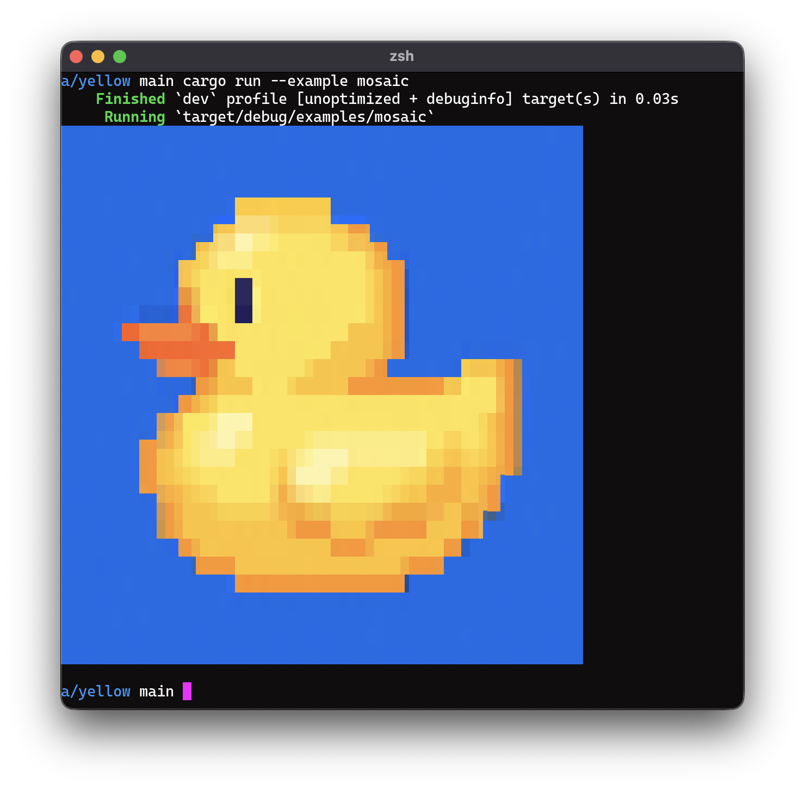
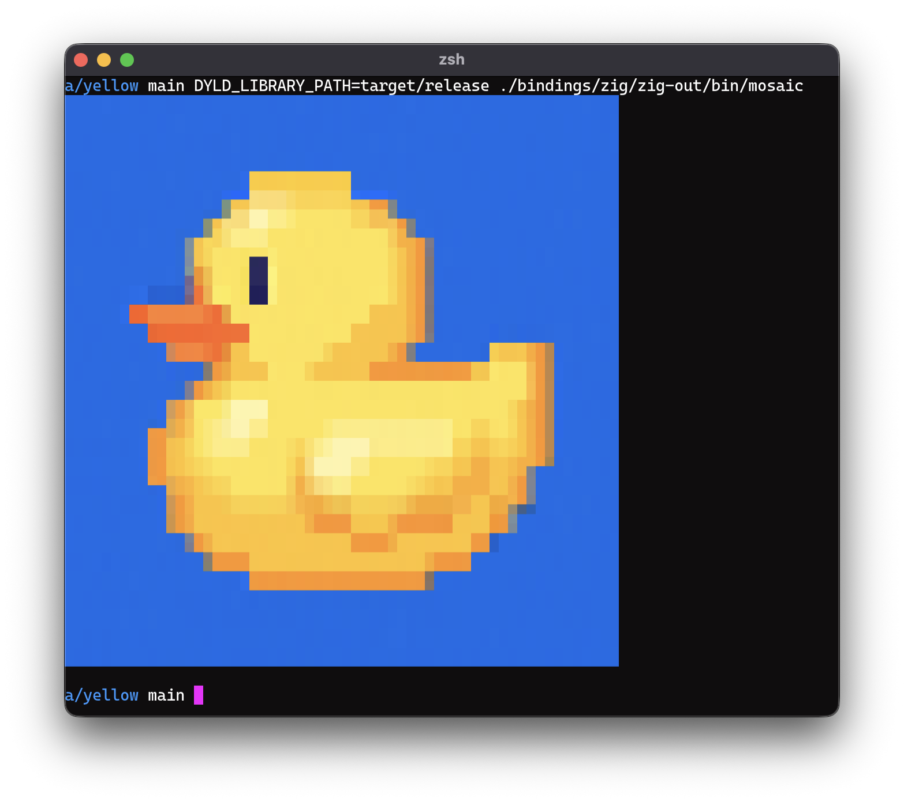

# Zaz

A terminal manipulation library for Rust and C/FFI bindings for other languages.



Zaz's mosaic demo with Zig wrapper



## Features

- Effiecient terminal rendering (Smart Style Caching, Paul Heckel's Diff Algorithm, Cost-based Cursor Movement, etc...)
- SIMD-Accelerated Line Comparison
- Terminal initialization and screen management
- Cursor positioning and text output
- RGB color support with ANSI escape codes
- Text attributes (bold, italic, underline, etc.)
- Window and panel management
- Keyboard input handling with Kitty keyboard protocol
- Graphics support (Kitty image protocol, Sixel)
- Unicode block mosaic rendering from images
- Scrolling regions

## Installation

### Rust

Add to your `Cargo.toml`:

```toml
[dependencies]
zaz = "*"
```

### Zig

> TODO: I will improve this flow eventually.

To use Zaz in your Zig project:

1. Build the Zaz library:
```bash
cargo build --release
```

2. Copy the necessary files to your project:
```bash
cp bindings/zig/zaz.zig your-project/
cp bindings/zig/zaz.h your-project/
cp target/release/libzaz.dylib your-project/  # macOS
# or
cp target/release/libzaz.so your-project/     # Linux
```

3. In your `build.zig`:
```zig
const zaz_mod = b.createModule(.{
    .root_source_file = b.path("zaz.zig"),
    .link_libc = true,
});
zaz_mod.addIncludePath(b.path("."));

const exe = b.addExecutable(.{
    .name = "my-app",
    .root_source_file = b.path("main.zig"),
    .target = target,
    .optimize = optimize,
});
exe.root_module.addImport("zaz", zaz_mod);
exe.addIncludePath(b.path("."));
exe.addLibraryPath(b.path("."));
exe.linkSystemLibrary("zaz");
exe.linkLibC();
```

4. Run with library path:
```bash
# macOS
DYLD_LIBRARY_PATH=. zig build run

# Linux
LD_LIBRARY_PATH=. zig build run
```

## Usage

### Rust Example

```rust
use zaz::{Screen, Color, Attr};

fn main() -> Result<(), Box<dyn std::error::Error>> {
    let mut scr = Screen::init()?;

    scr.clear()?;
    scr.mvprint(2, 4, "Hello from Zaz!")?;

    scr.set_fg(Color::Rgb(255, 200, 0))?;
    scr.attron(Attr::BOLD)?;
    scr.mvprint(4, 4, "Colored text!")?;

    scr.refresh()?;
    scr.getch()?;
    scr.endwin()?;

    Ok(())
}
```

### Zig Example

```zig
const std = @import("std");
const zaz = @import("zaz");

pub fn main() !void {
    const screen = try zaz.Screen.init();
    defer screen.deinit() catch {};

    try screen.clear();
    try screen.mvprint(2, 4, "Hello from Zig + Zaz!");

    try screen.setFgColor(255, 200, 0);
    try screen.attrOn(.bold);
    try screen.mvprint(4, 4, "Colored text!");
    try screen.attrOff(.bold);

    try screen.refresh();
    _ = try screen.getch();
}
```

## Running Examples

### Rust Examples

```bash
# Basic demo
cargo run --example demo

# Mosaic rendering from image
cargo run --example mosaic
```

### Zig Examples

```bash
# Basic example
make run-zig

# Or run directly:
DYLD_LIBRARY_PATH=target/release ./bindings/zig/zig-out/bin/basic

# Mosaic example (loads and displays yellow.png as Unicode art)
make run-zig-mosaic

# Or run directly:
DYLD_LIBRARY_PATH=target/release ./bindings/zig/zig-out/bin/mosaic
```

On Linux, use `LD_LIBRARY_PATH` instead of `DYLD_LIBRARY_PATH`.

## C FFI API

The library exports a C-compatible API for use with other languages:

### Screen Management
- `zaz_init()` - Initialize screen
- `zaz_endwin()` - Clean up and restore terminal
- `zaz_clear()` - Clear screen
- `zaz_refresh()` - Refresh display

### Output
- `zaz_print()` - Print at cursor position
- `zaz_mvprint()` - Print at specific position
- `zaz_move_cursor()` - Move cursor

### Colors and Attributes
- `zaz_set_fg_color()` - Set foreground RGB color
- `zaz_set_bg_color()` - Set background RGB color
- `zaz_attron()` - Enable text attributes
- `zaz_attroff()` - Disable text attributes

### Input
- `zaz_getch()` - Get key input

### Utilities
- `zaz_get_size()` - Get terminal dimensions
- `zaz_render_mosaic()` - Render image as Unicode art
- `zaz_free_string()` - Free mosaic string

## License

See LICENSE file for details.
